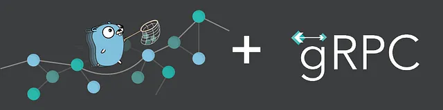
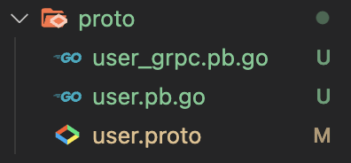

# Understanding-gRPC-Golang
<h1 align="center">
  
</h1>

Microservices architecture is one of the preferred methods of building scalable and robust applications. It involves breaking large applications into smaller components that are well-defined, performs a specific task and uses sets of application programming interface (API) for their communication.

Communication is an essential part of microservices; it plays an important role in letting services talk to each other within the larger application context. Some examples of protocol microservices use to communicate with each other includes HTTP, gRPC, message brokers, et

##  What is gRPC? 
gRPC is a modern communication framework that can run in any environment and helps connect services efficiently. It was introduced in 2015 and governed by the Cloud Native Computing Platform (CNCF). Beyond efficiently connecting services across a distributed system, mobile applications, frontend to backend, etc., it supports health checking, load balancing, tracing, and authentication.

gRPC offers a fresh perspective to developers building medium to complex applications as it can generate client and server bindings for multiple languages. The following are some of its benefits:

* Service definition:
    gRPC uses Protocol Buffers as its interface description language, similar to JSON and provides features like authentication, cancellation, timeouts, etc
* Lightweight and performant:
    gRPC definitions are 30 percent smaller than JSON definitions and are 5 to 7 times faster than a traditional REST API.
* Multiple platform support:
    gRPC is language agnostic and has automated code generation for client and server-supported languages.
* Scalable:
    From the developer’s environment to production, gRPC is designed to scale millions ler seconds requests.

## Getting Started

Now that we understand gRPC's importance in building scalable applications, let’s build a user management service with gRPC, MongoDB, and Golang.

### Prerequisites

Requirements for the software and other tools to build, test and push 
- Basic understanding of Golang
- Basic understanding of Protocol Buffer
- Protocol Buffer [compiler](https://www.mongodb.com/cloud/atlas/register?utm_source=fullstackwriter&utm_medium=fullstackwriter-blog) installed
- A [MongoDB account](https://www.mongodb.com/?utm_source=fullstackwriter&utm_medium=fullstackwriter-blog) to host the database. Signup is **completely free**.
- **Postman** or any gRPC testing application

##  Project and Dependencies setup 
To get started, we need to navigate to the desired directory and run the command below in our terminal:
````
mkdir gRPC-Golang-Understanding && cd gRPC-Golang-Understanding
````
This command creates a Golang project called grpc_go and navigates into the project directory.

Next, we need to initialize a Go module to manage project dependencies by running the command below:
````
go mod init github.com/AbdulrahmanDaud10/Golang-gRPC-understanding
````
This command will create a go.mod file for tracking project dependencies.

We proceed to install the required dependencies with:
````
go get google.golang.org/grpc go.mongodb.org/mongo-driver/mongo github.com/joho/godotenv google.golang.org/protobuf
````
- `google.golang.org/grpc` is the Golang implementation of gRPC.

- `go.mongodb.org/mongo-driver/mongo` is a driver for connecting to MongoDB.

- `github.com/joho/godotenv` is a library for managing environment variables.

- `google.golang.org/protobuf` is the Golang implementation of Protocol Buffers.

## How To Use

To clone and run this application, you'll need [Git](https://git-scm.com) and [Node.js](https://nodejs.org/en/download/) (which comes with [npm](http://npmjs.com)) installed on your computer. From your command line:

```bash
# Clone this repository
$ git clone https://github.com/AbdulrahmanDaud10/Golang-gRPC-understanding

# Go into the repository
$ cd Golang-gRPC-understanding

# Install dependencies
$ go mod tidy

# Run the app
$ go run main.go
```
## Defining The User Management Protocol Buffer & Compilation
To get started, we need to define a Protocol Buffer to represent all the operations and responses involved in the user management service. To do this, first, we need to create a `proto` folder in the root directory, and in this folder, create a `user.proto` file and add the snippet below:

````
syntax = "proto3";
package user;
option go_package = "grpc_go/proto";

service UserService {
    rpc GetUser (UserRequest) returns (UserResponse);
    rpc CreateUser (CreateUserRequest) returns (CreateUserResponse);
    rpc UpdateUser (UpdateUserRequest) returns (UpdateUserResponse);
    rpc DeleteUser (DeleteUserRequest) returns (DeleteUserResponse);
    rpc GetAllUsers (Empty) returns (GetAllUsersResponse);
}

message UserRequest {
    string id = 1;
}

message UserResponse {
    string id = 1;
    string name = 2;
    string location = 3;
    string title = 4;
}

message CreateUserRequest {
    string name = 2;
    string location = 3;
    string title = 4;
}

message CreateUserResponse {
    string data = 1;
}

message UpdateUserRequest {
    string id = 1;
    string name = 2;
    string location = 3;
    string title = 4;
}

message UpdateUserResponse {
    string data = 1;
}

message DeleteUserRequest {
    string id = 1;
}

message DeleteUserResponse {
    string data = 1;
}

message Empty {}

message GetAllUsersResponse {
    repeated UserResponse users = 1;
}
````
The snippet above does the following:
- Specifies the use of proto3 syntax
- Declares user as the package name
- Uses the go_package option to define the import path of the package and where the generated code will be stored
- Creates a service to Create, Read, Edit, and Delete (CRUD) a user and their corresponding responses as messages.

Lastly, we need to compile the user.proto file using the command below:
````
$ protoc --go_out=. --go_opt=paths=source_relative     --go-grpc_out=. --go-grpc_opt=paths=source_relative     proto/user.proto
````
The command above uses the Protocol Buffer compiler to generate Golang server and client code by specifying the relative part and using the user.proto file.

    To avoid errors, we must ensure we add Golang to the path.

On successful compilation, we should see user_grpc.pb.go and user.pb.go files added to the proto folder. These files contain the gRPC-generated server and client code. 

<h1 align="center">
  
</h1>

## Credits

This software uses the following open source packages:

- [gRPC](https://grpc.io/docs/what-is-grpc/introduction/)
- [Golang](https://go.dev/learn/)
- [GitHub README Templates](https://www.readme-templates.com/)
- [Atlas MongoDB](https://www.mongodb.com/atlas/database)
- [Postman](http://codemirror.net/)
- Scaffolding A gRPC service with Go (Golang) For Production [here](https://blog.devgenius.io/scaffolding-a-grpc-service-with-go-golang-for-production-9de91f6198b0)

## You may also like...

- [ Golang Protocol Buffer implementation ](https://grpc.io/docs/protoc-installation/?utm_source=fullstackwriter&utm_medium=fullstackwriter-blog) - How to install the protocol buffer compiler.
- [MongoDB Golang driver](https://github.com/mongodb/mongo-go-driver?utm_source=fullstackwriter&utm_medium=fullstackwriter-blog) -  The Official Golang driver for MongoDB 

## Let's Connect
---

> [abdulrahmandaud10.github.io/](abdulrahmandaud10.github.io/) &nbsp;&middot;&nbsp;
> GitHub [@AbdulrahmanDaud10](https://github.com/AbdulrahmanDaud10) &nbsp;&middot;&nbsp;
> Twitter [@AbdulDaudMiraj](https://twitter.com/AbdulDaudMiraj)
